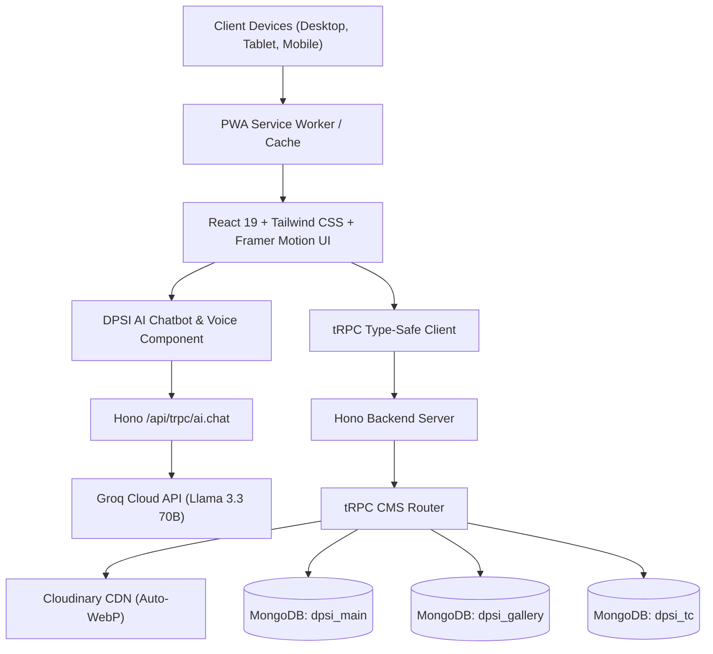

# 🏫 Delhi Public School Indirapuram (DPSI) — Next-Gen School Web Platform & Admin CMS

A fullstack enterprise web platform and comprehensive Content Management System (CMS) engineered for **Delhi Public School Indirapuram (DPS Indirapuram)**. Built with React 19, TypeScript, tRPC v11, Hono, MongoDB Atlas multi-database architecture, Cloudinary CDN auto-WebP transcoding, and Groq-powered AI Voice Assistant (`llama-3.3-70b-versatile`).

---

## 🌟 Table of Contents
1. [Architecture & System Design](#-architecture--system-design)
2. [Why We Use What (Technology Rationale)](#-why-we-use-what-technology-rationale)
3. [Core Feature Breakdown](#-core-feature-breakdown)
   - [Public-Facing Experience](#1-public-facing-experience)
   - [DPSI AI Assistant & Voice Integration](#2-dpsi-ai-assistant--voice-integration)
   - [Comprehensive Admin Portal & CMS](#3-comprehensive-admin-portal--cms)
   - [Transfer Certificate (TC) & Bulk Importer](#4-transfer-certificate-tc--bulk-importer)
4. [Database & Schema Architecture](#-database--schema-architecture)
5. [API & tRPC Router Structure](#-api--trpc-router-structure)
6. [Getting Started & Setup](#-getting-started--setup)
7. [Environment Configuration](#-environment-configuration)
8. [Build & Deployment Guide](#-build--deployment-guide)

---

## 🏗️ Architecture & System Design



---

## 💡 Why We Use What (Technology Rationale)

Every technology in this stack was carefully chosen to balance extreme performance, developer velocity, type safety, and real-time reliability:

| Technology | Role | Why We Use It |
| :--- | :--- | :--- |
| **React 19 + TypeScript** | Frontend UI Framework | Modern React concurrent rendering, hooks ecosystem, and strict TypeScript types ensure zero runtime type mismatch errors across components. |
| **Vite 7** | Build & Dev Tooling | Lightning-fast Hot Module Replacement (HMR) and optimized Rollup production bundling with granular code splitting. |
| **Hono** | Backend Web Framework | Ultra-lightweight, zero-overhead edge-compatible web framework that runs seamlessly in Node.js, Cloudflare Workers, and Bun environments. |
| **tRPC v11** | End-to-End Type Safety | Eliminates API contract drift. Changing a database query or schema immediately reflects in compile-time checks in the frontend without generating SDKs. |
| **MongoDB Atlas (Multi-DB Architecture)** | Database | Document structure aligns naturally with rich CMS content, dynamic menus, and nested activity structures. Isolated into 3 discrete databases (`dpsi_main`, `dpsi_gallery`, `dpsi_tc`) for performance, scaling, and data separation. |
| **Cloudinary** | Media Storage & CDN | Automatically transcodes uploaded PNG/JPEG/HEIC images into compressed **WebP format**, reducing payload sizes by up to 80% while retaining crisp visual quality on mobile and desktop. |
| **Groq (`llama-3.3-70b-versatile`)** | AI Voice & Chat Assistant | Groq's LPU architecture delivers ~180+ tokens/second inference speed. This ultra-low latency makes live conversational AI voice responses instantaneous (<1 second response time) without sluggish reasoning pauses. |
| **Framer Motion + Lucide** | Animations & Icons | Hardware-accelerated transitions, interactive hover dynamics, standardized icon set for enterprise admin aesthetics. |
| **PWA (vite-plugin-pwa)** | Progressive Web App | Provides offline caching, app manifest, installability on iOS/Android, and fast asset delivery. |

---

## 🚀 Core Feature Breakdown

### 1. Public-Facing Experience
- **Dynamic Header & Footer**: Navigation links, dropdown menus, and quick resource links are 100% dynamically loaded from MongoDB.
- **Hero Slider**: Admin-curated banners, slogans, and CTA buttons.
- **Marquee Announcement Ticker**: Real-time scrolling notices with configurable speed and external links.
- **Interactive 3D Facilities Showcase**: 3D scene built with React Three Fiber featuring graceful WebGL context-loss recovery fallbacks.
- **Academics & Department Explorer**: Comprehensive curriculum breakdown, CBSE results data, and streams.
- **MUN Portal**: Dedicated Model United Nations section with registration submission and committee allocations.
- **Popup Modal System**: Configurable school notifications and admission alerts that trigger on first visit.

### 2. DPSI AI Assistant & Voice Integration
- **Model**: `llama-3.3-70b-versatile` running on Groq LPUs.
- **Knowledge Base**: Curated with 50+ accurate DPSI school facts (leadership, CBSE 99.4% toppers, 40+ facilities, admissions workflow, quarterly fee structures, transport GPS network, shooting range, Olympic pool).
- **Multilingual Support**: Automatically detects and replies in warm English or fluent Hindi / Hinglish.
- **Dynamic Knowledge Sync**: Reads custom system prompts directly from MongoDB (`AiConfig` collection), allowing school administrators to update chatbot knowledge on the fly from the admin portal without redeploying code.

### 3. Comprehensive Admin Portal & CMS (`/admin`)
An enterprise dashboard secured with SHA-256 hashed credentials and master admin recovery:

1. **Dashboard**: Live counter metrics for all databases and recent activity logs.
2. **Manage Pages**: Create, preview, edit, and publish dynamic pages using a full WYSIWYG rich text editor.
3. **Manage Menus**: Add header navigation items, footer quick links, sub-menus (parent-child relationships), display order, and live **Visible/Hidden toggle**.
4. **Image Gallery**: Direct Cloudinary file uploader with auto-conversion to WebP and category filters (Campus, Sports, Academics, Labs).
5. **Video Gallery**: YouTube URL parser with crash-proof validation, automatic thumbnail preview, category tagging, and edit capability.
6. **Popups**: Create, edit, enable, or disable site-wide notice popups.
7. **Marquee Ticker**: Manage continuous scrolling announcements.
8. **Recent Activities**: Publish photo-documented events, sports victories, and academic milestones.
9. **Home Sliders**: Control carousel images, order, headlines, and action buttons.
10. **Attachments & Circulars**: Upload official PDF circulars, syllabus files, and notices.
11. **MUN Registrations**: Review delegate applicants, committee preferences, approve/reject delegates, and monitor payments.
12. **Site Settings**: Centralized interface to manage school contact numbers, official emails, campus addresses, and social links across the website.
13. **AI Configuration**: Edit the chatbot's system prompt, temperature, and model selection directly from the UI.

### 4. Transfer Certificate (TC) & Bulk Importer
- **Public Search Portal** (`/tc`): Instant search by Student Admission Number or Name.
- **Single TC Creation**: Add individual certificates with issue dates and PDF links.
- **Bulk CSV Importer**:
  - Paste multi-line CSV data or upload `.csv` files.
  - Expected schema: `admissionNumber, studentName, fatherName, motherName, classLeaving, dateOfIssue, status`
  - Interactive **Parse & Preview** grid validating rows before submission.
  - High-performance batch insertion via MongoDB `insertMany({ ordered: false })`.

---

## 🗄️ Database & Schema Architecture

The platform connects to MongoDB Atlas using distinct logical databases:

### 1. `dpsi_main`
- `Page`: Dynamic custom pages (title, slug, HTML content, meta tags).
- `Menu`: Navigation hierarchy (`header`, `footer_quick`, `footer_resources`, `parent`, `order`, `isActive`).
- `Popup`: Modal alerts (`title`, `content`, `imageUrl`, `isActive`, `showOnLoad`).
- `Marquee`: Scrolling announcements (`text`, `linkUrl`, `speed`, `isActive`).
- `Activity`: School events & news (`title`, `category`, `description`, `imageUrl`, `eventDate`).
- `Slider`: Homepage hero slides (`title`, `subtitle`, `imageUrl`, `buttonText`, `buttonLink`, `order`).
- `Attachment`: PDF documents & circulars (`title`, `category`, `fileUrl`, `fileName`).
- `MunRegistration`: Delegate applications (`studentName`, `email`, `schoolName`, `grade`, `committeePreference`, `status`).
- `SiteSettings`: Key-value configuration pairs (`school_name`, `contact_phone`, `contact_email`, `contact_address`, etc.).
- `AiConfig`: Bot parameters (`systemPrompt`, `modelId`, `temperature`, `maxTokens`).

### 2. `dpsi_gallery`
- `GalleryImage`: Photos with Cloudinary CDN WebP URLs and category references.
- `VideoGallery`: YouTube videos (`title`, `category`, `youtubeUrl`, `thumbnailUrl`).
- `GalleryCategory`: Category taxonomy management.

### 3. `dpsi_tc`
- `TransferCertificate`: Student transfer certificate archive (`admissionNumber`, `studentName`, `fatherName`, `classLeaving`, `dateOfIssue`, `status`).

---

## 🔌 API & tRPC Router Structure

All endpoints are strictly typed with Zod schemas and located in `api/`:

| Router | File | Purpose |
| :--- | :--- | :--- |
| `aiRouter` | `api/ai-router.ts` | Groq Llama 3.3 chat completion with dynamic prompt lookup and history compression. |
| `cmsRouter` | `api/cms-router.ts` | Comprehensive CMS CRUD (25+ mutations: menus, pages, sliders, activities, bulk TC, settings, AI config). |
| `galleryRouter` | `api/gallery-router.ts` | Image and video gallery public queries with fallbacks. |
| `eventsRouter` | `api/events-router.ts` | School activities and recent event queries. |
| `newsRouter` | `api/news-router.ts` | News announcements and press releases. |
| `achievementRouter` | `api/achievement-router.ts` | Student and faculty academic/sports milestones. |
| `announcementRouter` | `api/announcement-router.ts` | Flash announcements and header ticker feed. |
| `statsRouter` | `api/stats-router.ts` | School statistics counters (students, educators, labs, success rate). |
| `testimonialRouter` | `api/testimonial-router.ts` | Verified parent and alumni reviews. |
| `admissionRouter` | `api/admission-router.ts` | Online inquiry and registration handler. |
| `contactRouter` | `api/contact-router.ts` | Contact form submission handler. |

---

## 🛠️ Getting Started & Setup

### Prerequisites
- **Node.js**: v20.x or higher
- **npm** or **pnpm**
- **MongoDB Atlas** cluster connection URI
- **Cloudinary** account credentials
- **Groq Cloud API** key

### 1. Clone & Install
```bash
git clone https://github.com/ShashankJangid/dpsi-website.git
cd dpsi-website
npm install
```

### 2. Environment Setup
Create a `.env` file in the root directory:
```env
# MongoDB Atlas
MONGODB_URI="mongodb+srv://<username>:<password>@cluster0.e4cvux4.mongodb.net/?appName=Cluster0"

# Cloudinary CDN Storage
CLOUDINARY_URL="cloudinary://<api_key>:<api_secret>@<cloud_name>"

# Groq AI Assistant
GROQ_API_KEY="gsk_..."
VITE_GROQ_API_KEY="gsk_..."

# Server
PORT=3000
NODE_ENV=development
```

### 3. Run Development Server
```bash
npm run dev
```
The application will launch at `http://localhost:5173`.

---

## 📦 Build & Deployment Guide

### Production Build
```bash
npm run build
```
This compiles optimized production assets in `dist/public` and the backend server bundle in `dist/`.

### Running in Production
```bash
npm start
```
Or using **PM2** process manager:
```bash
npm install -g pm2
pm2 start dist/boot.js --name "dpsi-website"
pm2 save
pm2 startup
```

### Option B: Docker Deployment
```bash
docker build -t dpsi-website .
docker run -d -p 3000:3000 --env-file .env dpsi-website
```

---

## 🛡️ Security & Quality Standards
- **Rectangular UI Geometry**: Modern, clean rectangular aesthetics with standardized badge hierarchy.
- **Resilient Media Handlers**: Safe YouTube link extractors preventing React white-screen exceptions.
- **Connection Pooling**: Cached Mongoose client pools preventing connection exhaustion on MongoDB Atlas.
- **Strict Input Validation**: Every tRPC route is guarded by comprehensive Zod schemas.

---

## 👨‍💻 Maintainer & Author
- **Developer**: Shashank Jangid ([@ShashankJangid](https://github.com/ShashankJangid))
- **Project**: Delhi Public School Indirapuram Web Platform
- **License**: Copyright © DPS Indirapuram. All Rights Reserved.

